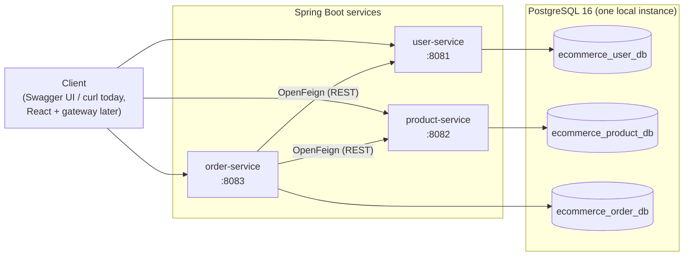
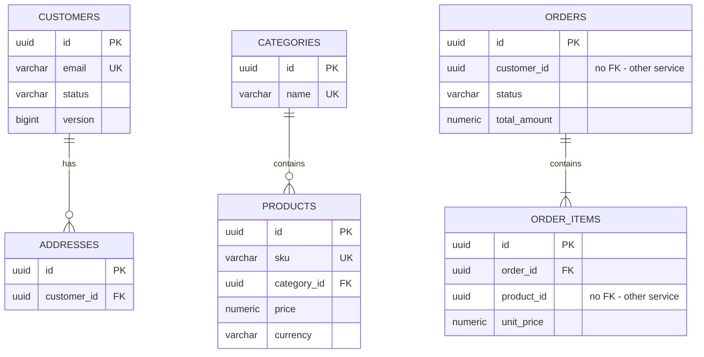

# Phase 1 Design

This document covers the design for all three Phase 1 services. Only `user-service` is implemented so far; `product-service` and `order-service` follow the same patterns and are built next, one at a time.

Each section ends with the same five questions: why we need it, what problem it solves, how it works, why this approach, and what an interviewer might ask.

---

## 1. Overall architecture



| Service | Owns | Port | Calls |
|---|---|---|---|
| user-service | Customers, addresses | 8081 | nothing |
| product-service | Products, categories | 8082 | nothing |
| order-service | Orders, order items | 8083 | user-service, product-service |

Each service is an independently buildable and deployable Spring Boot application with its own database. Clients call services directly for now. There is no API gateway, service discovery, authentication, messaging or cache yet; those are later phases and are left out on purpose so each one can be added and understood on its own.

**Why we need it.** An e-commerce domain splits naturally into "who is buying" (customers), "what is for sale" (catalogue) and "what was bought" (orders). These change at different rates, scale differently (catalogue reads dwarf everything else) and are often owned by different teams.

**What problem it solves.** In a monolith, one bad deploy or one slow query affects everything, and one shared schema means every team's change can break another's. Separate services contain failures and let each part evolve and scale on its own.

**How it works.** Three processes, three databases, communication over HTTP/JSON. Only order-service depends on the others, because placing an order genuinely needs customer and product data.

**Why this architecture.** Three services is the smallest split that still demonstrates the hard microservice problems: data ownership, cross-service validation, partial failure and eventual consistency. Starting with synchronous REST (not Kafka) keeps the first version debuggable with a browser and curl.

**Interviewer questions.**
- When would you *not* use microservices? (Small team, unclear domain boundaries, no need for independent scaling or deploys. A modular monolith is often the better start.)
- What is a "distributed monolith"? (Services that must be deployed together because they share a database, a common library of domain classes, or tightly coupled synchronous call chains.)
- Why doesn't user-service call order-service to check for open orders before deactivating? (Dependencies should point one way. If user-service needs that information later it should come from events, not a call back into order-service.)

---

## 2. Repository structure

```
ecommerce-platform/
├── pom.xml                      # aggregator only: builds all modules, shares nothing
├── docker-compose.yml           # PostgreSQL (+ optional app containers)
├── .env.example                 # template for local secrets; .env is git-ignored
├── infra/postgres/init/         # creates one database + one login per service
├── docs/
├── user-service/
│   ├── pom.xml                  # own parent (spring-boot-starter-parent), own versions
│   ├── Dockerfile
│   └── src/
│       ├── main/java/com/ecommerce/user/
│       │   ├── controller/      # HTTP adapters
│       │   ├── service/         # use cases, transactions
│       │   ├── repository/      # Spring Data interfaces
│       │   ├── entity/          # JPA entities + enums
│       │   ├── dto/             # request/response records (the API contract)
│       │   ├── mapper/          # entity <-> DTO
│       │   ├── exception/       # custom exceptions + global handler
│       │   └── configuration/   # Spring @Configuration classes
│       ├── main/resources/
│       │   ├── application.yml
│       │   └── db/migration/    # Flyway V1__..., V2__...
│       └── test/java/...        # unit, slice and integration tests
├── product-service/             # next
└── order-service/               # after that
```

**Why we need it.** A clear, repeatable layout makes each service instantly familiar and makes code review and onboarding easier.

**What problem it solves.** Without conventions, business logic drifts into controllers, entities leak into responses, and each service ends up structured differently.

**How it works.** One Git repository (monorepo), one folder per service, each with its own complete Maven build. The root `pom.xml` lists the modules so `mvn verify` at the root builds everything, but it is not a parent: no service inherits anything from it.

**Why this approach.** A monorepo keeps a portfolio project easy to clone and review. Independent builds keep services truly independent: product-service can upgrade a library without touching user-service. There is deliberately **no shared `common` module** of DTOs or entities; sharing domain classes between services is the most common path to a distributed monolith. Small duplication (the exception handler, `PageResponse`) is the accepted price.

Inside each service the code is organised by layer, as requested. The main alternative, package-by-feature (`customer/`, `address/`, each with its own controller/service/repository), scales better in large services; it is worth being able to discuss.

**Interviewer questions.**
- Monorepo vs polyrepo? (Monorepo: atomic cross-service changes, one place to look, but needs per-service CI triggers. Polyrepo: hard ownership boundaries, but cross-cutting changes need coordination.)
- Why not a shared library for DTOs? (It couples release cycles. Contracts are better shared as OpenAPI specs, or later as event schemas.)
- Package-by-layer vs package-by-feature?

---

## 3. Database architecture



The diagram shows three **separate databases**. Relationships drawn inside a box are real foreign keys. `orders.customer_id` and `order_items.product_id` point into other services' databases and are therefore plain UUID columns with **no** foreign key.

| Database | Tables | Owner login |
|---|---|---|
| ecommerce_user_db | customers, addresses | user_service |
| ecommerce_product_db | categories, products | product_service |
| ecommerce_order_db | orders, order_items | order_service |

Locally, all three databases live in one PostgreSQL container, but each service connects with its own login that can only reach its own database (`REVOKE ALL ... FROM PUBLIC` in the init script). In production these could be separate instances; the application code would not change, only the connection URLs.

**Conventions used in every service**

| Concern | Choice | Reason |
|---|---|---|
| Primary keys | `UUID`, generated by Hibernate | No coordination needed, safe to expose in URLs (not guessable or enumerable), merge cleanly into a data lake later |
| Money | `NUMERIC(19,2)` + `BigDecimal`, currency as ISO 4217 `VARCHAR(3)` | Floating point cannot represent money exactly |
| Timestamps | `TIMESTAMPTZ` + `java.time.Instant`, UTC | Unambiguous across time zones |
| Enums | `VARCHAR` + `CHECK` constraint, `@Enumerated(STRING)` | Readable, and reordering enum constants cannot corrupt data (unlike ORDINAL) |
| Concurrency | `version BIGINT` + `@Version` on mutable aggregates | Optimistic locking; lost updates become 409s |
| Deletion | Soft delete (status) for customers, products, categories | Orders reference them historically |
| Schema changes | Flyway migrations only; Hibernate `ddl-auto: validate` | Versioned, reviewable, repeatable schema history |

**Cross-service data: snapshots, not joins.** An order must still show what the customer paid even if the product's price changes or the product is deactivated next week. So order-service copies the values it needs at order time: `unit_price` per item and the full shipping address (stored as embedded columns in `orders`). This is intentional denormalisation. It is also why user-service can hard-delete addresses safely.

**Why we need it.** Each service must own its data outright, or it isn't really independent.

**What problem it solves.** A shared database lets any service read or change another's tables, so a column rename in one service can break three others, and nobody knows who owns what.

**How it works.** One database and one login per service; foreign keys only within a service; cross-service references are IDs validated through the owning service's API at write time.

**Why this approach.** "Database per service" is the standard pattern for service autonomy. One local PostgreSQL instance keeps laptops fast while still enforcing the boundary through permissions.

**Interviewer questions.**
- Without cross-database foreign keys, how do you keep data consistent? (Validate through the owning service at write time; accept that referenced data may later change; store snapshots of what must not change; later, react to events.)
- UUID vs BIGSERIAL? (UUIDs: no central sequence, not enumerable. Costs: 16 bytes vs 8, and random v4 UUIDs scatter B-tree inserts. Time-ordered UUIDv7 reduces that.)
- Why not let Hibernate create the schema? (`ddl-auto=update` can't do renames or data migrations, has no history, and is unsafe in production.)
- How would you report across services, e.g. revenue by customer country? (Not with cross-database joins. Stream or batch each service's data into an analytics store; that is the later Databricks / Delta Lake phase.)

---

## 4. API contract

**Conventions**

- Base path `/api/v1/...`; the version is in the URL so a future v2 can run alongside.
- JSON in and out; IDs are UUID strings; timestamps are ISO 8601 UTC.
- Collections use `?page=0&size=20&sort=field,asc|desc`. `size` is capped at 100. Responses use a stable envelope: `content`, `page`, `size`, `totalElements`, `totalPages`, `first`, `last`.
- Errors are RFC 9457 Problem Details (`application/problem+json`):

```json
{
  "type": "about:blank",
  "title": "Validation failed",
  "status": 400,
  "detail": "One or more fields are invalid.",
  "instance": "/api/v1/customers",
  "timestamp": "2026-09-12T14:03:11.402Z",
  "errors": [ { "field": "email", "message": "must be a well-formed email address" } ]
}
```

| Status | Meaning in this system |
|---|---|
| 200 OK | Read or update succeeded |
| 201 Created | Resource created; `Location` header points to it |
| 204 No Content | Delete / deactivate succeeded |
| 400 Bad Request | Validation failed, malformed JSON, bad UUID, unknown sort field |
| 404 Not Found | The resource in the URL does not exist |
| 409 Conflict | Duplicate (email, SKU), invalid state (inactive customer, illegal order transition), concurrent modification |
| 422 Unprocessable Content | order-service only: the request is well-formed but references something unusable (unknown or inactive product, inactive customer) |
| 503 Service Unavailable | order-service only: a downstream service is down or timed out |

**user-service (8081)** — implemented

| Method | Path | Success | Notes |
|---|---|---|---|
| POST | /api/v1/customers | 201 | Register. 409 if email exists (case-insensitive) |
| GET | /api/v1/customers | 200 | Paged. Optional `status` filter |
| GET | /api/v1/customers/{id} | 200 | Includes `status`; order-service checks it |
| GET | /api/v1/customers/{id}/profile | 200 | Customer + addresses |
| PUT | /api/v1/customers/{id} | 200 | firstName, lastName, phone. 409 if inactive |
| DELETE | /api/v1/customers/{id} | 204 | Soft delete, idempotent |
| POST | /api/v1/customers/{id}/addresses | 201 | |
| GET | /api/v1/customers/{id}/addresses | 200 | Not paged |
| GET | /api/v1/customers/{id}/addresses/{addressId} | 200 | Used by order-service |
| PUT | /api/v1/customers/{id}/addresses/{addressId} | 200 | |
| DELETE | /api/v1/customers/{id}/addresses/{addressId} | 204 | Hard delete (orders keep a snapshot) |

**product-service (8082)** — next

| Method | Path | Success | Notes |
|---|---|---|---|
| POST | /api/v1/categories | 201 | 409 on duplicate name |
| GET | /api/v1/categories | 200 | Paged |
| GET | /api/v1/categories/{id} | 200 | |
| PUT | /api/v1/categories/{id} | 200 | |
| DELETE | /api/v1/categories/{id} | 204 | Deactivate |
| POST | /api/v1/products | 201 | 409 on duplicate SKU; 422 if category missing/inactive |
| GET | /api/v1/products | 200 | Search + filter: `q`, `categoryId`, `status`, `minPrice`, `maxPrice`, paging, sorting |
| GET | /api/v1/products/{id} | 200 | |
| GET | /api/v1/products/lookup?ids=a,b,c | 200 | Batch lookup for order-service (max 100 ids) |
| PUT | /api/v1/products/{id} | 200 | |
| DELETE | /api/v1/products/{id} | 204 | Deactivate |

**order-service (8083)** — after product-service

| Method | Path | Success | Notes |
|---|---|---|---|
| POST | /api/v1/orders | 201 | Body: `customerId`, `shippingAddressId`, `items[{productId, quantity}]`. No prices from the client |
| GET | /api/v1/orders/{id} | 200 | |
| GET | /api/v1/customers/{customerId}/orders | 200 | Paged. Served by order-service even though the path starts with /customers |
| PATCH | /api/v1/orders/{id}/cancel | 200 | 409 if the order can no longer be cancelled |
| PATCH | /api/v1/orders/{id}/status | 200 | Body: `{ "status": "SHIPPED" }`. 409 on an illegal transition |

Order status transitions (anything else is a 409):

```
PENDING -> CONFIRMED -> PAYMENT_PENDING -> PAID -> PROCESSING -> SHIPPED -> DELIVERED
PENDING, CONFIRMED, PAYMENT_PENDING -> CANCELLED
```

Cancelling after `PAID` needs a refund flow, which belongs to a later payments phase.

**Interviewer questions.**
- PUT vs PATCH? (PUT replaces the representation and is idempotent; PATCH applies a partial change. `/cancel` is modelled as a PATCH command because it is a state transition, not a field edit.)
- Why is DELETE a soft delete, and why is it still idempotent?
- Why does `GET /customers/{id}/orders` live in order-service? (Ownership follows the data, not the URL. A gateway later routes that path to order-service.)
- How do you version an API? (URL, header or media type; the trade-offs; how to deprecate v1.)
- Why never accept prices from the client? (The client is untrusted; the server of record for price is product-service.)

---

## 5. Service communication design

Only order-service makes outbound calls. Creating an order:

```mermaid
sequenceDiagram
    autonumber
    participant C as Client
    participant O as order-service
    participant U as user-service
    participant P as product-service
    participant DB as order DB

    C->>O: POST /api/v1/orders {customerId, shippingAddressId, items}
    O->>U: GET /api/v1/customers/{customerId}
    U-->>O: 200 {status: ACTIVE, ...}
    O->>U: GET /api/v1/customers/{customerId}/addresses/{addressId}
    U-->>O: 200 address
    O->>P: GET /api/v1/products/lookup?ids=...
    P-->>O: 200 [ {id, price, currency, status}, ... ]
    Note over O: validate: all products found and ACTIVE,<br/>single currency; compute subtotals and total
    O->>DB: INSERT order + items (one local transaction)
    O-->>C: 201 Created, status PENDING
```

**Rules**

1. **Prices come from product-service, never the client**, and are copied into the order (`unit_price`, `subtotal`, `total_amount`).
2. **One batch call for products**, not one call per line item (avoids the N+1 problem across the network).
3. **Remote calls happen before the database transaction starts**, so a slow downstream service never holds a database connection or row locks.
4. **Timeouts on every Feign client** (connect ~2s, read ~3s). Without them one slow service can exhaust order-service's threads.
5. **Error translation at the boundary.** A downstream 404 becomes a 422 from order-service ("customer does not exist"), and a downstream timeout or 5xx becomes a 503. Callers of order-service never see raw Feign exceptions.
6. **No automatic retries on `POST /orders`** in Phase 1. Retrying GETs is safe; retrying order creation without an idempotency key could create duplicate orders.
7. **No distributed transaction.** Order-service commits its own data only. If a product is deactivated a second after validation, the order still stands at the price captured; this is the accepted consistency model.

Service URLs come from configuration (`USER_SERVICE_URL`, `PRODUCT_SERVICE_URL`) rather than discovery, which keeps Phase 1 simple and maps directly onto Docker Compose hostnames.

**Why we need it.** An order cannot be validated or priced without customer and product data owned by other services.

**What problem it solves.** It gives order-service authoritative, current data without reading other databases.

**How it works.** OpenFeign turns an annotated Java interface (`@FeignClient`, `@GetMapping`) into an HTTP client at runtime. We will see this in detail when order-service is built.

**Why this approach.** Synchronous REST is the simplest correct option when the caller needs an answer *now* to accept or reject the request. Its costs (temporal coupling, cascading latency and failure) are exactly what later phases address: Resilience4j for circuit breaking, Kafka events so order-service can keep a local copy of product prices, and the transactional outbox pattern for reliable events.

**Interviewer questions.**
- What happens when user-service is down? (Order creation fails fast with 503; reads of existing orders still work because they don't need user-service.)
- Sync vs async communication: when would you use each?
- What is a circuit breaker and what problem does it solve?
- How would you make order creation idempotent? (Client sends an `Idempotency-Key` header; the server stores it with the order and returns the original result on a retry.)
- What is the Saga pattern and when would you need it here? (When payment and inventory become separate services that must all succeed or be compensated.)
